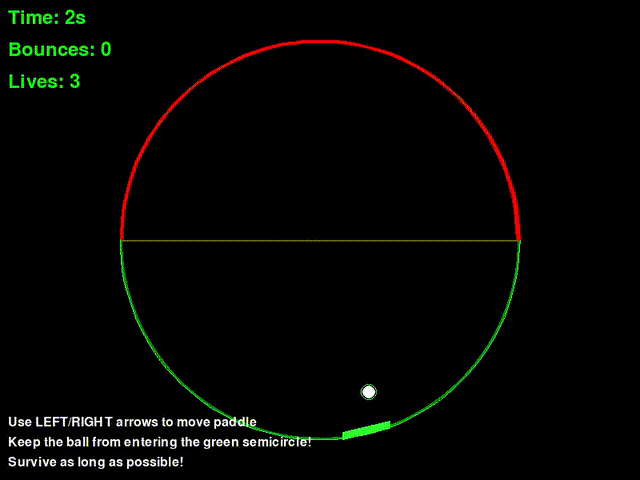

# Circular Pong Game

A retro-style single-player game inspired by Pong, where the paddle moves along a semicircular arc and the ball bounces within a full circle.

## Features

- **Semicircular Paddle Movement**: Control a paddle that moves along the green semicircle (0° to 180°)
- **Circular Ball Physics**: Ball bounces off the circular boundary with realistic reflection physics
- **Zone Defense Gameplay**: Prevent the ball from entering the green semicircle without being hit by your paddle
- **Lives System**: Get 3 chances before game over - lose a life each time the ball enters the green zone undefended
- **Score System**: Track time survived and number of paddle bounces
- **Sound Effects**: Retro beeps for paddle hits, wall bounces, life loss, and game over
- **Retro Aesthetics**: Green-on-black color scheme with glow effects and colored zones

## Controls

- **Left Arrow**: Move paddle counterclockwise within the green zone
- **Right Arrow**: Move paddle clockwise within the green zone
- **R**: Restart game (when game over)
- **ESC**: Quit game

## Installation

1. Make sure you have Python 3.6+ installed
2. Install required dependencies:
   ```bash
   pip install -r requirements.txt
   ```
   Or directly:
   ```bash
   pip install pygame numpy
   ```

## Running the Game

```bash
python circular_pong.py
```

## Gameplay

- The paddle moves along the green semicircle (0° to 180°) and protects this zone
- The ball starts by moving towards the red semicircle (180° to 360°) - the safe zone
- The ball bounces off the circular boundary and can move freely in the red zone
- **Objective**: Prevent the ball from entering the green semicircle without hitting your paddle
- If the ball enters the green zone without being defended, you lose a life
- You have 3 lives total - the game ends when all lives are lost
- Try to survive as long as possible and rack up paddle bounces!



## Visual Zones

- **Green Semicircle (0° to 180°)**: Protected zone where the paddle moves and defends
- **Red Semicircle (180° to 360°)**: Safe zone where the ball can bounce freely
- **Yellow Center Line**: Visual separator between the two zones

## Code Structure

The game is organized into modular classes:

- `Ball`: Handles ball physics, movement, and circular boundary collision
- `Paddle`: Manages paddle movement along the green semicircular arc with collision detection
- `Game`: Main game logic, collision detection, lives system, scoring, sound effects, and rendering

The code includes comprehensive comments explaining the physics calculations, game mechanics, and zone-based gameplay.

## Physics Details

- Ball reflection off circular boundary uses vector math for realistic bouncing
- Paddle collision detection uses point-to-line distance calculations with cooldown system
- Small random variations prevent predictable ball patterns
- Speed normalization maintains consistent ball velocity
- Collision cooldown prevents multiple bounce increments

## Sound Effects

- **Paddle Hit**: High-pitched beep when ball hits paddle
- **Wall Bounce**: Medium-pitched beep when ball bounces off circular boundary
- **Life Lost**: Low-pitched beep when you lose a life
- **Game Over**: Noise sound when all lives are lost

Enjoy the game!

## About This Project

This game was developed as part of the **Amazon Q Build Games Challenge (June–July 2025)** using Amazon Q Developer CLI.  
Learn more about the challenge: #BuildGamesChallenge #AmazonQDevCLI
